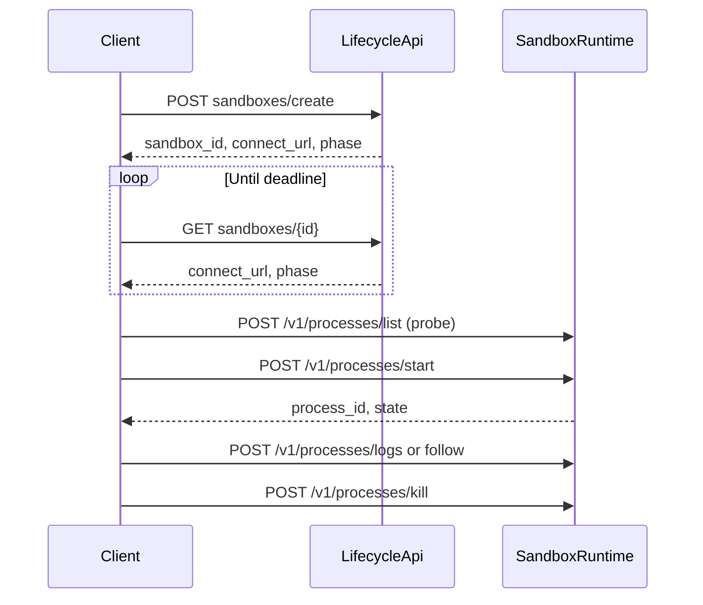

# NeevAI Python SDK — API Inventory

Complete, hand-maintained inventory of the public `neevai` package: per-method
reference, type field tables, symbol index, and contract notes. Use this document
when you need exhaustive detail on the entire SDK surface.

For installation, credentials, and first scripts, see
[`getting-started.md`](./getting-started.md). For lifecycle vs runtime API
lists and copy-paste snippets, see [`api-reference.md`](./api-reference.md). For
which examples demonstrate which APIs, see
[`example-coverage.md`](./example-coverage.md).

## Table of contents

- Getting started → [`getting-started.md`](./getting-started.md)
- [Top-level exports](#top-level-exports)
- [Client](#client)
- [Sandboxes resource](#sandboxes-resource)
  - [create](#clientsandboxescreateparams-org_idnone-project_idnone)
  - [list](#clientsandboxeslistpage-none-limit-none-org_idnone-project_idnone)
  - [get](#clientsandboxesgetid-org_idnone-project_idnone)
  - [pause](#clientsandboxespauseid-org_idnone-project_idnone)
  - [resume](#clientsandboxesresumeid-org_idnone-project_idnone)
  - [delete](#clientsandboxesdeleteid-org_idnone-project_idnone)
  - [metrics](#clientsandboxesmetricsid-from_none-to-none-step-none-org_idnone-project_idnone)
  - [create_snapshot](#clientsandboxescreate_snapshotid-paramsnone-org_idnone-project_idnone)
  - [list_snapshots](#clientsandboxeslist_snapshotsid-page-none-limit-none-org_idnone-project_idnone)
  - [get_snapshot](#clientsandboxesget_snapshotsnapshot_id-org_idnone-project_idnone)
  - [delete_snapshot](#clientsandboxesdelete_snapshotsnapshot_id-org_idnone-project_idnone)
  - [restore](#clientsandboxesrestoreid-snapshot_id-org_idnone-project_idnone)
  - [fork](#clientsandboxesforkid-name-org_idnone-project_idnone)
- [Agents resource](#agents-resource)
- [Agent templates resource](#agent-templates-resource)
- [Templates resource](#templates-resource)
- [Agent handle](#agent-handle)
- [Sandbox handle](#sandbox-handle)
- [Exec and streaming](#exec-and-streaming)
- [Files API](#files-api)
- [Processes API](#processes-api)
- [Runtime connection](#runtime-connection)
- [Raw client](#raw-client)
- [Types reference](#types-reference)
- [Errors](#errors)
- [Pagination types](#pagination-types)
- [Sync/async parity](#syncasync-parity)
- [Symbol index by module](#symbol-index-by-module)
- [Contract notes](#contract-notes)
- [Maintaining this inventory](#maintaining-this-inventory)

---

## Top-level exports

Everything in `neevai.__all__`:

| Symbol | Kind | Module |
| ------ | ---- | ------ |
| `NeevAI` | class | `client.py` |
| `AsyncNeevAI` | class | `client.py` |
| `RawClient` | class | `transport/lifecycle.py` |
| `AsyncRawClient` | class | `transport/lifecycle.py` |
| `Sandbox` | class | `handles/sandbox.py` |
| `AsyncSandbox` | class | `handles/sandbox.py` |
| `Agent` | class | `handles/agent.py` |
| `AsyncAgent` | class | `handles/agent.py` |
| `AgentPage` / `AsyncAgentPage` | dataclass | `resources/agents.py` |
| `ListAgentsParams` | dataclass | `resources/agents.py` |
| `AgentTemplatePage` / `AsyncAgentTemplatePage` | dataclass | `resources/agent_templates.py` |
| `ListAgentTemplatesParams` | dataclass | `resources/agent_templates.py` |
| `AgentData` | model | `types.py` |
| `AgentStatus` | enum | generated |
| `CreateAgentParams` | model alias | generated → `CreateAgentRequest` |
| `UpdateAgentParams` | model alias | generated → `UpdateAgentRequest` |
| `AgentListResponse` | model | `types.py` |
| `AgentTemplate` | model | generated |
| `AgentTemplateListResponse` | model | generated |
| `SandboxConnection` | class | `runtime/connection.py` |
| `AsyncSandboxConnection` | class | `runtime/connection.py` |
| `SandboxFiles` | class | `runtime/connection.py` |
| `AsyncSandboxFiles` | class | `runtime/connection.py` |
| `SandboxProcesses` | class | `runtime/processes.py` |
| `AsyncSandboxProcesses` | class | `runtime/processes.py` |
| `Process` | class | `runtime/processes.py` |
| `AsyncProcess` | class | `runtime/processes.py` |
| `Signal` | class | `types.py` |
| `ProcessStatus` | model | `types.py` |
| `ProcessInfo` | model | `types.py` |
| `ProcessLogsPage` | model | `types.py` |
| `Scope` | dataclass | `types.py` |
| `Snapshot` | model | generated |
| `SnapshotStatus` | enum | generated |
| `CreateSnapshotParams` | model | `types.py` |
| `SnapshotListResponse` | model | generated |
| `NeevAIError` … `InternalServerError` | exceptions | `errors.py` |

Types exported from `neevai.types.__all__`:

| Symbol | Kind | Source |
| ------ | ---- | ------ |
| `CreateSandboxParams` | model alias | `generated/aiagent.py` → `CreateSandboxRequest` |
| `EnvVar` | model | generated |
| `SandboxData` | model | `types.py` subclass of generated `Sandbox` with `phase: str` |
| `SandboxListResponse` | model | `types.py` (`items: list[SandboxData]`) |
| `SandboxTemplate` | model | generated |
| `SandboxTemplateListResponse` | model | generated |
| `SandboxMetricsResponse` | model | generated |
| `MetricSeries` | model | generated |
| `SandboxPhase` | type alias | `Literal["Pending", "Ready", "NotReady", "Unknown", "Paused", "Pausing", "Resuming"]` (SDK; spec enum omits transitional values) |
| `SandboxPhaseEnum` | enum | generated → `SandboxPhase` |
| `Scope` | dataclass | `types.py` |
| `FileEntry` | model | `types.py` |
| `ExecResult` | model | `types.py` |
| `ExecStreamEvent` | type alias | union of stream TypedDicts |
| `StdoutStreamEvent` | TypedDict | `types.py` |
| `StderrStreamEvent` | TypedDict | `types.py` |
| `ExitStreamEvent` | TypedDict | `types.py` |
| `ProcessState` | type alias | `Literal["running", "exited"]` |
| `ProcessStatus` | model | `types.py` |
| `ProcessInfo` | model | `types.py` |
| `ProcessLogEntry` | model | `types.py` |
| `ProcessLogsPage` | model | `types.py` |
| `ProcessLogEvent` | type alias | same union as `ExecStreamEvent` |
| `Signal` | class | `types.py` |

---

## Client

### `NeevAI(...)`

Synchronous platform client. Exposes three resource namespaces:

- `client.sandboxes` — CRUD and metrics for sandboxes in a project
- `client.agents` — CRUD and lifecycle for agents in a project
- `client.agent_templates` — read-only agent template catalogue (global)
- `client.templates` — read-only sandbox template catalogue
- `client.raw` — untyped API escape hatch

**Parameters:**

| Name | Type | Default | Description |
| ---- | ---- | ------- | ----------- |
| `api_key` | `str \| None` | `NEEV_API_KEY` | Bearer token |
| `org_id` | `str \| None` | `NEEV_ORG_ID` | Default org scope |
| `project_id` | `str \| None` | `NEEV_PROJECT_ID` | Default project scope |
| `base_url` | `str \| None` | `https://api.ai.neevcloud.com/agent` | Lifecycle URL |
| `timeout_ms` | `int` | `60000` | Per-request timeout |
| `max_retries` | `int` | `2` | Retries on network / 429 / 5xx |
| `client` | `httpx.Client \| None` | new client | Inject custom HTTP client |

**Raises:** `NeevAIError` if `api_key` is missing.

Use as a context manager to ensure the HTTP transport is closed:

```python
with NeevAI(api_key="...", org_id="...", project_id="...") as client:
    sandbox = client.sandboxes.create({...})
```

### `NeevAI.close()`

Closes the underlying HTTP transport. Called automatically when exiting a `with`
block.

### `AsyncNeevAI(...)` / `AsyncNeevAI.aclose()`

Async variant with identical constructor parameters and resource layout. Use
`async with AsyncNeevAI() as client:` and `await client.aclose()` when not using a
context manager.

---

## Sandboxes resource

Access via `client.sandboxes` (`Sandboxes`) or `await client.sandboxes` on
`AsyncNeevAI` (`AsyncSandboxes`). Unless noted, async variants use `await` with
identical parameters; return types use `AsyncSandbox` / `AsyncSandboxPage` instead
of their sync counterparts.

All sandbox resource methods require a resolved org/project scope. Missing scope
raises `NeevAIError` before any HTTP request is sent.

### `client.sandboxes.create(params, org_id=None, project_id=None)`

Creates a new sandbox in the resolved project context.

**Parameters:**

| Name | Type | Description |
| ---- | ---- | ----------- |
| `params` | `CreateSandboxParams \| Mapping[str, Any]` | Create body |
| `org_id` | `str \| None` | Override org (else client default) |
| `project_id` | `str \| None` | Override project (else client default) |

**Returns:** `Sandbox` handle with initial API state (`phase` is typically
`Pending` immediately after create).

**Raises:** `NeevAIError` (missing scope), `BadRequestError`,
`AuthenticationError`, `PermissionDeniedError`, `ConflictError`, `RateLimitError`,
`InternalServerError`, etc.

```python
sandbox = client.sandboxes.create({
    "name": "my-agent",
    "sandbox_template_id": "tmpl-abc123",
    "env": [{"name": "LOG_LEVEL", "value": "debug"}],
})
sandbox.wait_until_ready()

# Or provision from a snapshot:
restored = client.sandboxes.create({
    "name": "restored-agent",
    "sandbox_template_id": "tmpl-abc123",
    "from_snapshot": str(snap.id),
})
```

**Async:** `sandbox = await client.sandboxes.create(...)`

**Examples:** [`sandbox_lifecycle.py`](../examples/sandbox_lifecycle.py),
[`snapshot_fork_restore.py`](../examples/snapshot_fork_restore.py) (`from_snapshot`)

### `client.sandboxes.list(page=None, limit=None, org_id=None, project_id=None)`

Lists sandboxes with server-side pagination.

**Returns:** `SandboxPage` with fields `items`, `total`, `page`, `limit`. Each item
is a `Sandbox` handle bound to the client.

```python
page = client.sandboxes.list(page=1, limit=20)
for sb in page.items:
    print(sb.id, sb.name, sb.phase, sb.replicas)
print(f"Showing {len(page.items)} of {page.total}")
```

**Example:** [`sandbox_lifecycle_controller.py`](../examples/sandbox_lifecycle_controller.py)

### `client.sandboxes.get(id, org_id=None, project_id=None)`

Fetches a single sandbox by UUID.

**Returns:** `Sandbox` handle.

**Raises:** `NotFoundError` if the sandbox does not exist.

```python
sandbox = client.sandboxes.get("550e8400-e29b-41d4-a716-446655440000")
print(sandbox.phase, sandbox.connect_url)
```

### `client.sandboxes.pause(id, *, preserve_memory=None, org_id=None, project_id=None)`

Scales the sandbox to 0 replicas. Lifecycle phase becomes `Paused`. When
`preserve_memory` is set, it is sent in the request body (`PauseSandboxRequest`);
omit it to use the server default (`true`).

**Returns:** Updated `Sandbox` handle (not `None`).

```python
paused = client.sandboxes.pause(sandbox.id)
assert paused.phase == "Paused"
assert paused.replicas == 0
```

A paused sandbox will not become `Ready` until `resume()` is called. Calling
`wait_until_ready()` on a paused handle raises `NeevAIError`.

### `client.sandboxes.resume(id, org_id=None, project_id=None)`

Scales the sandbox back to 1 replica, moving it toward `Ready`.

**Returns:** Updated `Sandbox` handle (not `None`).

```python
resumed = client.sandboxes.resume(sandbox.id)
resumed.wait_until_ready()
```

**Examples:** [`sandbox_lifecycle.py`](../examples/sandbox_lifecycle.py),
[`sandbox_lifecycle_controller.py`](../examples/sandbox_lifecycle_controller.py)

### `client.sandboxes.delete(id, org_id=None, project_id=None)`

Permanently deletes a sandbox. Returns `None`.

```python
client.sandboxes.delete(sandbox.id)
# or via handle:
sandbox.delete()
```

### `client.sandboxes.metrics(id, from_=None, to=None, step=None, org_id=None, project_id=None)`

Queries live health metrics for a sandbox over a time range.

**Returns:** `SandboxMetricsResponse` with `series: list[MetricSeries]`.

```python
metrics = client.sandboxes.metrics(
    sandbox.id,
    from_="2026-06-01T00:00:00Z",
    to="2026-06-01T01:00:00Z",
    step="1m",
)
for series in metrics.series:
    print(series.metric, series.unit, len(series.points))
```

**Example:** [`sandbox_metrics.py`](../examples/sandbox_metrics.py)

### `client.sandboxes.create_snapshot(id, params=None, org_id=None, project_id=None)`

Creates a filesystem snapshot of a sandbox. Returns immediately with
`status=Pending`; poll `get_snapshot` until `Ready` before restoring.

**Parameters:**

| Name | Type | Description |
| ---- | ---- | ----------- |
| `id` | `str` | Sandbox UUID to snapshot |
| `params` | `CreateSnapshotParams \| Mapping[str, Any] \| None` | Optional `name`, `retain_for` (TTL duration) |
| `org_id` / `project_id` | `str \| None` | Override client scope |

The SDK always sends `include_memory: false` on the wire.

**Returns:** `Snapshot` with `status` typically `Pending`.

```python
pending = client.sandboxes.create_snapshot(sandbox.id, {"name": "demo-snap"})
# or via handle:
pending = sandbox.snapshot({"name": "demo-snap"})
```

**Async:** `pending = await client.sandboxes.create_snapshot(...)`

**Example:** [`snapshot_fork_restore.py`](../examples/snapshot_fork_restore.py)

### `client.sandboxes.list_snapshots(id, page=None, limit=None, org_id=None, project_id=None)`

Lists snapshots captured from a sandbox.

**Returns:** `list[Snapshot]` (pagination items unwrapped).

```python
snaps = client.sandboxes.list_snapshots(sandbox.id)
# or via handle:
snaps = sandbox.snapshots()
```

**Async:** `snaps = await client.sandboxes.list_snapshots(...)`

### `client.sandboxes.get_snapshot(snapshot_id, org_id=None, project_id=None)`

Fetches snapshot metadata by project-scoped snapshot ID. Use to poll snapshot
status after `create_snapshot`.

**Returns:** `Snapshot`.

**Raises:** `NotFoundError` if the snapshot does not exist.

```python
current = client.sandboxes.get_snapshot(str(pending.id))
if current.status == SnapshotStatus.Ready:
    ...
```

**Async:** `current = await client.sandboxes.get_snapshot(...)`

**Example:** [`snapshot_fork_restore.py`](../examples/snapshot_fork_restore.py)

### `client.sandboxes.delete_snapshot(snapshot_id, org_id=None, project_id=None)`

Permanently deletes a snapshot. Returns `None`.

```python
client.sandboxes.delete_snapshot(str(snap.id))
```

**Async:** `await client.sandboxes.delete_snapshot(...)`

**Example:** [`snapshot_fork_restore.py`](../examples/snapshot_fork_restore.py)

### `client.sandboxes.restore(id, snapshot_id, org_id=None, project_id=None)`

Restores a sandbox **in place** from a snapshot. Overwrites the sandbox's
filesystem with the snapshot contents.

**Returns:** Updated `Sandbox` handle.

**Note:** Prefer creating a new sandbox with `from_snapshot` in create params for
rollback workflows — see [`snapshot_fork_restore.py`](../examples/snapshot_fork_restore.py).
In-place restore may leave an empty workspace on some backends.

```python
restored = client.sandboxes.restore(sandbox.id, str(snap.id))
# or via handle (updates state in place, invalidates runtime connection):
sandbox.restore(str(snap.id))
```

**Async:** `restored = await client.sandboxes.restore(...)`

### `client.sandboxes.fork(id, name, org_id=None, project_id=None)`

Forks a sandbox into a **new** sandbox seeded from its current filesystem state.

**Returns:** New `Sandbox` handle for the fork.

```python
fork = client.sandboxes.fork(sandbox.id, "fork-name")
# or via handle:
fork = sandbox.fork("fork-name")
```

**Async:** `fork = await client.sandboxes.fork(...)`

**Example:** [`snapshot_fork_restore.py`](../examples/snapshot_fork_restore.py)

### Restore via `from_snapshot` on create

To roll back without mutating the original sandbox, pass `from_snapshot` when
creating a new sandbox:

```python
restored = client.sandboxes.create({
    "name": "restored-from-snap",
    "sandbox_template_id": template_id,
    "from_snapshot": str(snap.id),
})
restored.wait_until_ready()
```

**Example:** [`snapshot_fork_restore.py`](../examples/snapshot_fork_restore.py)

---

## Agents resource

Access via `client.agents` (`Agents`). Requires org/project scope.

### `client.agents.create(params, org_id=None, project_id=None)`

**Params:** `CreateAgentParams` or dict. Required: `name`, `agent_template` (template
**name**, e.g. `"claude-code"`). Optional: `region`, `config`, `env`, `resources`, `egress`.

**Returns:** `Agent` handle with `status` typically `Provisioning`.

```python
agent = client.agents.create({
    "name": "my-agent",
    "agent_template": "claude-code",
})
```

**Example:** [`create_agent.py`](../examples/create_agent.py)

### `client.agents.list(page=None, limit=None, org_id=None, project_id=None)`

**Returns:** `AgentPage` with `items: list[Agent]`. Omits `page`/`limit` from query when unset.

### `client.agents.get(id, org_id=None, project_id=None)`

**Returns:** `Agent`. **Raises:** `NotFoundError` if unknown.

### `client.agents.update(id, params, org_id=None, project_id=None)`

In-place update of `egress` and/or `resources` (cpu/memory). **Empty update guard:**
passing `{}` raises `NeevAIError` locally — no HTTP call.

```python
agent = client.agents.update(agent.id, {"resources": {"cpu": 2, "memory_gb": 4}})
```

### `client.agents.pause(id, ...)` / `client.agents.resume(id, ...)` / `client.agents.delete(id, ...)`

Pause and resume return updated `Agent` handles. Delete returns `None` (HTTP 204).

---

## Agent templates resource

Access via `client.agent_templates`. Read-only catalogue with **no** org/project scope.
Paths: `/api/v1beta1/agent-templates`.

### `client.agent_templates.list(page=None, limit=None)`

**Returns:** `AgentTemplatePage`. Omits `page`/`limit` from query when unset.

### `client.agent_templates.get(template_id)`

**Returns:** `AgentTemplate`. **Raises:** `NotFoundError` if unknown.

**Example:** [`create_agent.py`](../examples/create_agent.py)

---

## Templates resource

Access via `client.templates`. Read-only catalogue with no org/project scope.

### `client.templates.list(page=None, limit=None)`

**Returns:** `TemplatePage` with `items: list[SandboxTemplate]`.

```python
page = client.templates.list(limit=10)
for tmpl in page.items:
    print(tmpl.id, tmpl.name, tmpl.category, tmpl.status)
```

**Example:** [`templates_list.py`](../examples/templates_list.py)

### `client.templates.get(template_id)`

**Returns:** `SandboxTemplate`.

**Raises:** `NotFoundError` if the template id is unknown.

```python
tmpl = client.templates.get("tmpl-abc123")
print(tmpl.description)
```

---

## Agent handle

Returned by `client.agents.create()`, `get()`, and `list().items`. Holds mutable
in-memory state mirroring the last API response.

### Properties

| Property | Type | Description |
| -------- | ---- | ----------- |
| `id` | `str` | Agent UUID |
| `name` | `str` | DNS-1123 label |
| `status` | `str` | `Provisioning`, `Ready`, `Paused`, `Failed`, `Deleting`, or future values |
| `sandbox_id` | `str` | Backing sandbox UUID |
| `agent_template_id` | `str` | Catalogue template id (e.g. `ag-claude-code`) |
| `config` | `dict \| None` | Effective merged configuration |
| `data` | `dict[str, Any]` | Full record snapshot |

### `agent.wait_until_ready(timeout_ms=120000, poll_interval_ms=2000, on_poll=None)`

Polls `refresh()` until `status == "Ready"`.

**Raises:**

- `NeevAIError` if `timeout_ms` or `poll_interval_ms` is not a positive finite number
- `NeevAIError` on timeout (includes agent id and last status)
- `NeevAIError` if status is `Failed`
- `NeevAIError` if status is `Paused` (call `resume()` first)

Does **not** fail fast on `Deleting` (matches TypeScript SDK).

### `agent.sandbox()`

Resolves the backing sandbox as a `Sandbox` handle via `Agents.get_sandbox()`.

### `agent.update(params)` / `agent.pause()` / `agent.resume()` / `agent.delete()`

Delegate to `client.agents` with scope threading. Empty `update({})` raises locally.

**Example:** [`create_agent.py`](../examples/create_agent.py)

---

## Sandbox handle

Returned by `create()`, `get()`, and `list().items`. Holds mutable in-memory state
mirroring the last API response. Call `refresh()` to sync from the server.

### Properties

| Property | Type | Description |
| -------- | ---- | ----------- |
| `id` | `str` | Sandbox identifier (UUID string) |
| `name` | `str` | Human-readable name |
| `phase` | `str` | OpenAPI steady states: `"Pending"`, `"Ready"`, `"NotReady"`, `"Unknown"`, `"Paused"`. API may also return transitional values (e.g. `"Pausing"`, `"Resuming"`) not in the spec enum; SDK accepts any phase string. |
| `replicas` | `int` | `0` or `1` |
| `connect_url` | `str \| None` | Regional runtime URL (available when ready) |
| `data` | `dict[str, Any]` | Full record snapshot |

### `sandbox.refresh()`

Re-fetches the sandbox from the API and updates this handle in place.

**Returns:** `self`.

**Raises:** `NeevAIError` if the handle has no client context.

```python
sandbox.refresh()
print(sandbox.phase, sandbox.replicas)
```

### `sandbox.wait_until_ready(timeout_ms=120000, poll_interval_ms=2000, on_poll=None)`

Polls `refresh()` until `phase == "Ready"`. Sandbox runtime operations (`exec`,
`files`, `processes`) establish a lazy connection on first use via `_connection()`.

**Raises:**

- `NeevAIError` on timeout
- `NeevAIError` if sandbox is `Paused` (call `resume()` first)

Optional `on_poll` callback receives the handle on each poll iteration — useful for
progress logging:

```python
def log_progress(sb: Sandbox) -> None:
    print(f"  polling… phase={sb.phase}")

sandbox.wait_until_ready(on_poll=log_progress)
```

### `sandbox.pause(preserve_memory=None)` / `sandbox.resume()` / `sandbox.delete()`

Convenience wrappers that delegate to `client.sandboxes` and update handle state in
place (except `delete`, which removes the remote resource).

Both `pause()` and `resume()` return the updated `Sandbox` handle. `pause()` accepts
optional `preserve_memory` (forwarded to `PauseSandboxRequest`; omit to use the
server default `true`):

```python
sandbox = sandbox.pause(preserve_memory=True)   # phase → Paused, replicas → 0
sandbox = sandbox.resume()  # scales back, then wait for Ready
sandbox.wait_until_ready()
```

### `sandbox.metrics(from_=None, to=None, step=None)`

Same as `client.sandboxes.metrics(self.id, ...)` using the handle's scope.

### `sandbox.snapshot(params=None)` / `sandbox.snapshots()`

Convenience wrappers for `create_snapshot` and `list_snapshots` on this sandbox.

`snapshot` returns a `Snapshot` model (not a handle). `snapshots` returns `list[Snapshot]`.

```python
pending = sandbox.snapshot({"name": "demo-snap"})
all_snaps = sandbox.snapshots()
```

**Example:** [`snapshot_fork_restore.py`](../examples/snapshot_fork_restore.py)

### `sandbox.restore(snapshot_id)` / `sandbox.fork(name)`

`restore` delegates to `client.sandboxes.restore`, updates handle state in place,
invalidates the cached runtime connection, and returns `self`. `fork` returns a
new `Sandbox` handle.

For rollback workflows, prefer `client.sandboxes.create({..., "from_snapshot": ...})`
over in-place `restore` — see
[`snapshot_fork_restore.py`](../examples/snapshot_fork_restore.py).

```python
# In-place restore (mutates this sandbox):
sandbox.restore(str(snap.id))

# Recommended rollback — new sandbox from snapshot:
restored = client.sandboxes.create({
    "name": "restored",
    "sandbox_template_id": template_id,
    "from_snapshot": str(snap.id),
})

fork = sandbox.fork("fork-name")
```

**Example:** [`snapshot_fork_restore.py`](../examples/snapshot_fork_restore.py) (`fork`,
`from_snapshot` create)

### `sandbox.to_json()`

Returns the raw API record as a JSON-compatible `dict` suitable for
`json.dumps(sandbox.to_json())`.

---

## Exec and streaming

Sandbox runtime command execution requires the sandbox to be `Ready` with a populated
`connect_url`. Most callers use `sandbox.exec` / `sandbox.exec_stream` rather than
constructing `SandboxConnection` directly.

### `sandbox.exec(command, args=None, cwd=None, env=None, timeout_ms=None, stdin=None)`

Runs a command and buffers stdout/stderr until completion.

| Parameter | Description |
| --------- | ----------- |
| `command` | Shell string or argv list (`["ls", "-la"]`) |
| `args` | Extra argv when `command` is a string (mutually exclusive with list `command`) |
| `cwd` | Working directory (workspace-relative) |
| `env` | `dict[str, str]` merged into environment |
| `timeout_ms` | Command timeout |
| `stdin` | Optional stdin text |

**Returns:** `ExecResult` with `stdout`, `stderr`, `exit_code`.

```python
# argv form (preferred)
result = sandbox.exec(["python3", "-c", "import sys; print(sys.version)"])

# string + args form
result = sandbox.exec("echo", args=["hello", "world"])

# with environment and working directory
result = sandbox.exec(
    ["sh", "-c", "echo $MY_VAR > out.txt && cat out.txt"],
    cwd="workspace",
    env={"MY_VAR": "test-value"},
    timeout_ms=30_000,
)

if result.exit_code != 0:
    print(f"Command failed: {result.stderr}")
else:
    print(result.stdout)
```

**Async:** `result = await sandbox.exec(...)`

**Example:** [`parallel_fanout.py`](../examples/parallel_fanout.py)

### `sandbox.exec_stream(...)`

Same parameters as `exec`. Yields `ExecStreamEvent` dicts as output arrives.

Event shapes:

| `type` | Fields |
| ------ | ------ |
| `"stdout"` | `data: str` |
| `"stderr"` | `data: str` |
| `"exit"` | `exit_code: int` |

```python
for event in sandbox.exec_stream(
    ["sh", "-c", "for i in 1 2 3; do echo line-$i; sleep 0.5; done"]
):
    if event["type"] == "stdout":
        print(event["data"], end="")
    elif event["type"] == "stderr":
        print(f"[stderr] {event['data']}", end="", file=sys.stderr)
    elif event["type"] == "exit":
        print(f"\nProcess exited with code {event['exit_code']}")
```

Sync: `for event in sandbox.exec_stream(...)`. Async:
`async for event in sandbox.exec_stream(...)`.

**Example:** [`streaming_exec.py`](../examples/streaming_exec.py)

---

## Files API

Access via the `sandbox.files` property (`SandboxFiles` / `AsyncSandboxFiles`).
Paths are **workspace-relative**; absolute paths are rejected by the sandbox.

### `sandbox.files.write(path, content, cwd=None)`

Writes string or bytes to a file.

**Returns:** `dict[str, int]` with key `bytes_written`.

```python
info = sandbox.files.write("src/main.py", 'print("hello")\n')
print(f"Wrote {info['bytes_written']} bytes")
```

### `sandbox.files.read(path, cwd=None)` / `read_text(path, cwd=None)`

Read raw bytes or UTF-8 decoded text.

```python
raw = sandbox.files.read("data.bin")
text = sandbox.files.read_text("README.md")
```

### `sandbox.files.list(path, cwd=None, recursive=False, max_count=None)`

**Returns:** `list[FileEntry]` with `name`, `type`, `path`, `size`, `mode`,
`permissions`, `modified_time`, and optional `symlink_target`.

```python
entries = sandbox.files.list(".", recursive=True)
for entry in entries:
    print(f"{entry.type:10} {entry.path} ({entry.size} bytes)")
```

**Examples:** [`files_api.py`](../examples/files_api.py),
[`workflow_examples/repo_analyzer.py`](../examples/workflow_examples/repo_analyzer.py)

### `sandbox.files.stat(path, cwd=None)`

**Returns:** a single `FileEntry` for `path`.

```python
entry = sandbox.files.stat("README.md")
print(entry.type, entry.size, entry.modified_time)
```

### `sandbox.files.exists(path, cwd=None)`

**Returns:** `bool` — whether `path` exists.

```python
if not sandbox.files.exists("out"):
    sandbox.files.mkdir("out")
```

### `sandbox.files.mkdir(path, cwd=None)`

Creates a directory (and any missing parents). **Returns:** the `FileEntry` for the new directory.

### `sandbox.files.move(source, destination, cwd=None)`

Moves or renames a path. **Returns:** the `FileEntry` for the destination.

### `sandbox.files.remove(path, cwd=None, recursive=False)`

Removes a file, or a directory when `recursive=True`. **Returns:** `None`.

### `sandbox.files.watch(path, cwd=None, recursive=False, timeout_ms=None)`

Streams filesystem changes under `path`. **Returns:** an iterator (async iterator on the
async client) of `WatchEvent` — `type` (`create` / `write` / `remove` / `rename` / `chmod`),
`path`, and `entry` (a `FileEntry`, absent on removal). The stream ends on timeout,
cancellation, or disconnect.

```python
for event in sandbox.files.watch(".", recursive=True):
    print(event.type, event.path)
```

**Examples:** [`files_api.py`](../examples/files_api.py)

---

## Processes API

Access via `sandbox.processes` (`SandboxProcesses` / `AsyncSandboxProcesses`) or
`connection.processes` on a raw runtime connection. Detached processes outlive
the HTTP request that started them; use `sandbox.exec` for request-scoped commands.

All endpoints are **POST** to `{connect_url}/v1/processes/*` with no retries.

### End-to-end flow

Supervised processes require both the **the API** (create/get sandbox) and the
**sandbox runtime** (`connect_url`). A typical sequence:



#### Prerequisites before `processes.start`

1. **Create** — `client.sandboxes.create(...)` returns a handle with `sandbox_id`,
   `phase` (often `Pending`), and sometimes `connect_url`.
2. **Wait for `connect_url`** — poll `sandbox.refresh()` until `connect_url` is set.
   The URL may appear while `phase` is still `Pending` or `NotReady`; do not call
   sandbox runtimes until you also complete the steps below.
3. **Wait for Ready** — `sandbox.wait_until_ready()` until `phase == "Ready"`.
4. **Probe sandbox runtime** — call `sandbox.processes.list()` and retry transient
   `502` / `503` / `504` (or connection errors) until the sandbox accepts requests.

This matches [`examples/processes.py`](../examples/processes.py) and
[`examples/process_pool.py`](../examples/process_pool.py). Tunables:

| Variable | Default | Purpose |
| -------- | ------- | ------- |
| `NEEVAI_WAIT_TIMEOUT_MS` | `300000` | Shared deadline for connect URL, Ready, and runtime probe |
| `NEEVAI_POLL_INTERVAL_MS` | `2000` | Sleep between `refresh()` / probe retries |

#### Authentication (runtime)

Every `{connect_url}/v1/processes/*` request requires:

| Header | Value |
| ------ | ----- |
| `Authorization` | `Bearer <NEEV_API_KEY>` (same key as the API) |
| `X-Sandbox-Id` | `<sandbox_id>` UUID from create/get |

The SDK sends both headers automatically when using `sandbox.processes` or
`SandboxConnection(..., sandbox_id=str(sandbox.id))`.

#### Raw HTTP endpoints

| Method | Path | Body highlights |
| ------ | ---- | --------------- |
| POST | `/v1/processes/start` | `program`, `args`, `cwd`, `env`, `stdin` |
| POST | `/v1/processes/get` | `process_id`, optional `wait` |
| POST | `/v1/processes/list` | `{}` |
| POST | `/v1/processes/kill` | `process_id`, optional `signal` |
| POST | `/v1/processes/kill-all` | optional `signal` |
| POST | `/v1/processes/logs` | `process_id`, optional `cursor`; add `follow: true` and `Accept: application/x-ndjson` for streaming |

`env` on the wire is a list of `"KEY=value"` strings (the SDK accepts a `dict`).

#### Raw HTTP examples (start)

After create/get returns `connect_url` and the sandbox is Ready:

```bash
export NEEV_API_KEY="..."
export CONNECT_URL="https://..."
export SANDBOX_ID="550e8400-e29b-41d4-a716-446655440000"

curl -sS -X POST "${CONNECT_URL}/v1/processes/start" \
  -H "Authorization: Bearer ${NEEV_API_KEY}" \
  -H "X-Sandbox-Id: ${SANDBOX_ID}" \
  -H "Content-Type: application/json" \
  -d '{"program":"sh","args":["-c","echo hello"]}'
```

PowerShell:

```powershell
$headers = @{
    Authorization  = "Bearer $env:NEEV_API_KEY"
    "X-Sandbox-Id" = $sandboxId
    "Content-Type" = "application/json"
}
$body = @{ program = "sh"; args = @("-c", "echo hello") } | ConvertTo-Json -Compress

Invoke-RestMethod -Method Post `
  -Uri "$connectUrl/v1/processes/start" `
  -Headers $headers `
  -Body $body
```

#### SDK end-to-end example

Short flow mirroring the examples (inline wait — production code may extract helpers):

```python
import os
import time

from neevai import NeevAI, Signal

WAIT_MS = int(os.environ.get("NEEVAI_WAIT_TIMEOUT_MS", "300000"))
POLL_MS = int(os.environ.get("NEEVAI_POLL_INTERVAL_MS", "2000"))

with NeevAI() as client:
    sandbox = client.sandboxes.create({
        "name": "processes-demo",
        "sandbox_template_id": "sb-ubuntu-26-04-minimal",
    })
    deadline = time.time() + WAIT_MS / 1000.0

    while not sandbox.connect_url and time.time() < deadline:
        time.sleep(POLL_MS / 1000.0)
        sandbox.refresh()
    sandbox.wait_until_ready(timeout_ms=WAIT_MS, poll_interval_ms=POLL_MS)
    while time.time() < deadline:
        try:
            sandbox.processes.list()
            break
        except Exception:
            time.sleep(POLL_MS / 1000.0)

    proc = sandbox.processes.start(["sh", "-c", "for i in 1 2 3; do echo line-$i; sleep 1; done"])
    for event in proc.follow():
        if event["type"] == "stdout":
            print(event["data"], end="")
        elif event["type"] == "exit":
            break

    page = proc.logs()
    print(f"polled {len(page.entries)} entries")

    for info in sandbox.processes.list():
        print(info.process_id, info.state)

    proc.kill(signal=Signal.TERM)
    print(proc.wait().exit_code)
    sandbox.delete()
```

#### Troubleshooting

| Symptom | Likely cause | What to do |
| ------- | ------------ | ---------- |
| `401` / invalid credentials | Wrong or expired `NEEV_API_KEY` | Use the same Bearer token as API calls |
| `connect_url` is `None` | Sandbox still provisioning | Keep calling `sandbox.refresh()` until the URL appears |
| Sandbox runtime `502` / `503` / `504` right after Ready | Runtime not accepting traffic yet | Retry `sandbox.processes.list()` (see prerequisites) |
| `follow` read timeout on a quiet process | No stdout/stderr for longer than HTTP read timeout | Prefer `proc.follow()` (SDK manages streaming) or increase client read timeout |

### `sandbox.processes.start(program, args=None, cwd=None, env=None, stdin=None)`

**Returns:** `Process` handle with cached initial `ProcessStatus`.

`program` is a shell string or argv list. `args` is only valid when `program` is
a string (mutually exclusive with list `program`).

```python
from neevai import Signal

proc = sandbox.processes.start(
    ["python3", "-m", "http.server", "8080"],
    cwd="workspace",
    env={"PORT": "8080"},
)
print(proc.id, proc.state)
```

**Async:** `proc = await sandbox.processes.start(...)`

### `sandbox.processes.get(process_id, wait=False)` / `Process.status()` / `Process.wait()`

**Returns:** `ProcessStatus` with `process_id`, `state`, `exit_code`, `started_at`.

```python
status = sandbox.processes.get(proc.id)
final = proc.wait()  # blocks until exit
```

### `sandbox.processes.list()`

**Returns:** `list[ProcessInfo]` (`ProcessStatus` + `name`, `args`, `cwd`).

### `sandbox.processes.kill(process_id, signal=None)` / `kill_all(signal=None)`

Default signal is SIGTERM (`Signal.TERM`). The SDK omits `signal` on the wire only
when `signal is None`; passing `signal=Signal.TERM` sends `{"signal": 15}`.
`kill` returns `bool` (`signalled`); `kill_all` returns `int` (`signalled_count`).

```python
proc.kill(signal=Signal.TERM)
count = sandbox.processes.kill_all(signal=Signal.TERM)
```

### `sandbox.processes.logs(process_id, cursor=None)`

Poll-mode UTF-8 log entries with a `stream` discriminator (`stdout` / `stderr`).

**Returns:** `ProcessLogsPage` with `entries`, `cursor`, `dropped`, `state`.

### `sandbox.processes.follow(process_id, cursor=None)`

Stream-mode NDJSON with base64-encoded stdout/stderr chunks. Yields
`ProcessLogEvent` dicts (`stdout` / `stderr` / `exit`). Unlike `exec_stream`, a
clean end without an `exit` frame does not raise.

```python
for event in proc.follow():
    if event["type"] == "stdout":
        print(event["data"], end="")
    elif event["type"] == "exit":
        print(f"exit {event['exit_code']}")
```

**Examples:** [`processes.py`](../examples/processes.py),
[`process_pool.py`](../examples/process_pool.py)

---

## Runtime connection

Low-level connection to the sandbox runtime. Constructed internally by
`sandbox.exec`, `sandbox.files`, and `sandbox.processes`; exposed for advanced use
cases. Pass `sandbox_id` so the transport sends `X-Sandbox-Id` on every request
(the sandbox handle does this automatically via `_connection()`).

### `SandboxConnection(connect_url, api_key, timeout_ms=60000, client=None, sandbox_id=None)`

| Method / property | Returns | Description |
| ----------------- | ------- | ----------- |
| `exec(...)` | `ExecResult` | Same signature as `sandbox.exec` |
| `exec_stream(...)` | `Iterator[ExecStreamEvent]` | Streaming variant |
| `files` | `SandboxFiles` | Workspace file APIs |
| `processes` | `SandboxProcesses` | Supervised process APIs |
| `close()` | `None` | Release HTTP transport |

Async mirror: `AsyncSandboxConnection` with `aclose()` instead of `close()`.

```python
from neevai import SandboxConnection

conn = SandboxConnection(
    sandbox.connect_url,
    api_key="...",
    sandbox_id=str(sandbox.id),
)
try:
    result = conn.exec(["uname", "-a"])
    print(result.stdout)
    procs = conn.processes.list()
finally:
    conn.close()
```

---

## Raw client

Untyped escape hatch over the API transport. Same auth, timeout, retry,
and error mapping as typed resources.

### `client.raw.request(method, path, query=None, body=None)`

**Returns:** Parsed JSON (`dict` / `list`) or `None` for HTTP 204.

```python
# List templates via raw HTTP
data = client.raw.request(
    "GET",
    "/api/v1beta1/sandbox-templates",
    query={"limit": 5, "page": 1},
)
for item in data["items"]:
    print(item["name"], item["id"])

# Create with explicit body (prefer typed client.sandboxes.create instead)
body = {
    "name": "raw-demo",
    "sandbox_template_id": template_id,
}
created = client.raw.request(
    "POST",
    f"/api/v1beta1/orgs/{org_id}/projects/{project_id}/sandboxes",
    body=body,
)
```

**Async:** `data = await client.raw.request(...)`

**Example:** [`raw_request.py`](../examples/raw_request.py)

---

## Types reference

Import from `neevai.types`. Lifecycle models are generated from
`specs/aiagent.yaml` (regenerate with `scripts/gen_types.py`). After spec changes,
manually verify field tables here and in [`api-reference.md`](./api-reference.md).

### `CreateSnapshotParams`

Caller-facing snapshot create options (`types.py`). The SDK sets `include_memory`
to `false` on the wire.

| Field | Type | Required |
| ----- | ---- | -------- |
| `name` | `str \| None` | no |
| `retain_for` | `str \| None` | no (TTL duration, e.g. `"720h"`; omitted = no expiry) |

### `Snapshot`

Generated snapshot metadata record.

| Field | Type | Required |
| ----- | ---- | -------- |
| `id` | `UUID` | yes |
| `sandbox_id` | `UUID` | yes |
| `org_id` | `str` | yes |
| `project_id` | `str` | yes |
| `name` | `str \| None` | no |
| `status` | `SnapshotStatus` | yes (`Pending`, `Running`, `Ready`, `Failed`) |
| `include_memory` | `bool` | yes |
| `source_region` | `str` | yes |
| `size_bytes` | `int \| None` | no |
| `error_message` | `str \| None` | no |
| `expires_at` | `datetime \| None` | no |
| `created_at` | `datetime` | yes |
| `updated_at` | `datetime` | yes |

### `CreateAgentParams`

Alias for generated `CreateAgentRequest`.

| Field | Type | Required |
| ----- | ---- | -------- |
| `name` | `str` (DNS-1123 label, max 63) | yes |
| `agent_template` | `str` | yes (template **name**, e.g. `claude-code`) |
| `region` | `str \| None` | no (set it in the create body) |
| `config` | `dict \| None` | no |
| `env` | `list[EnvVar] \| None` | no |
| `resources` | `SandboxResources \| None` | no |
| `egress` | `SandboxEgressConfig \| None` | no |

### `UpdateAgentParams`

| Field | Type | Required |
| ----- | ---- | -------- |
| `egress` | `SandboxEgressConfig \| None` | no (at least one field required on update) |
| `resources` | `SandboxResources \| None` | no |

### `AgentData`

Subclass of generated `Agent` with relaxed `status: str`.

| Field | Type | Required |
| ----- | ---- | -------- |
| `id` | `UUID` | yes |
| `org_id` | `str` | yes |
| `project_id` | `str` | yes |
| `name` | `str` | yes |
| `agent_template_id` | `str` | yes |
| `sandbox_id` | `UUID` | yes |
| `config` | `dict \| None` | no |
| `status` | `str` | yes |
| `created_at` | `datetime` | yes |
| `updated_at` | `datetime` | yes |

### `AgentTemplate`

Catalogue entry for packaged agents (`id` pattern `ag-…`).

| Field | Type | Required |
| ----- | ---- | -------- |
| `id` | `str` | yes |
| `name` | `str` | yes |
| `description` | `str` | yes |
| `category` | `str` | yes |
| `status` | `active` \| `deprecated` \| `disabled` | yes |
| `ui` | `dict` | yes |
| `config_schema` | `dict \| None` | no |
| `default_resources` | `SandboxResources \| None` | no |
| `default_egress` | `SandboxEgressConfig \| None` | no |
| `created_at` | `datetime` | yes |
| `updated_at` | `datetime` | yes |

### `CreateSandboxParams`

Alias for generated `CreateSandboxRequest`.

| Field | Type | Required |
| ----- | ---- | -------- |
| `name` | `str` (DNS-1123 label, max 63) | yes |
| `sandbox_template_id` | `str` (`sb-…` pattern) | no |
| `region` | `str \| None` | no (set it in the create body) |
| `env` | `list[EnvVar] \| None` | no |
| `resources` | `SandboxResources \| None` | no |
| `egress` | `SandboxEgressConfig \| None` | no |
| `from_snapshot` | `UUID \| None` | no |

### `EnvVar`

| Field | Type | Required |
| ----- | ---- | -------- |
| `name` | `str` | yes |
| `value` | `str` | yes |

### `SandboxData`

Full API sandbox record. Subclasses generated `Sandbox` with `phase: str`
so transitional or future phase strings from the API are accepted.

| Field | Type | Required |
| ----- | ---- | -------- |
| `id` | `UUID` | yes |
| `org_id` | `str` | yes |
| `project_id` | `str` | yes |
| `name` | `str` | yes |
| `region` | `str` | yes |
| `image` | `str` | yes (from template) |
| `command` | `list[str] \| None` | no |
| `env` | `list[EnvVar] \| None` | no |
| `resources` | `SandboxResources \| None` | no |
| `phase` | `str` | yes |
| `connect_url` | `str \| None` | no |
| `replicas` | `int` (0–1) | yes |
| `egress` | `SandboxEgressConfig \| None` | no |
| `sandbox_template_id` | `str \| None` | no |
| `created_by` | `str \| None` | no |
| `created_at` | `datetime` | yes |
| `updated_at` | `datetime` | yes |

On handles, `sandbox.phase` returns a `str` (not the generated enum). The OpenAPI spec lists five steady-state phases; the API may return additional transitional strings during pause/resume.

### `SandboxTemplate`

| Field | Type | Required |
| ----- | ---- | -------- |
| `id` | `str` | yes |
| `name` | `str` | yes |
| `description` | `str` | yes |
| `category` | enum | yes |
| `status` | enum | yes |
| `created_at` | `datetime` | yes |
| `updated_at` | `datetime` | yes |

### `SandboxListResponse` / `SandboxTemplateListResponse`

| Field | Type |
| ----- | ---- |
| `items` | list |
| `total` | `int` |
| `page` | `int` |
| `limit` | `int` |

### `SandboxMetricsResponse`

| Field | Type | Required |
| ----- | ---- | -------- |
| `sandbox_id` | `UUID` | yes |
| `from_` | `datetime` | yes (JSON key `from`) |
| `to` | `datetime` | yes |
| `step` | `str` | yes |
| `series` | `list[MetricSeries]` | yes |

### `MetricSeries`

| Field | Type | Required |
| ----- | ---- | -------- |
| `metric` | `str` | yes |
| `unit` | `str \| None` | no |
| `points` | `list[list[float]]` | yes |

### `Scope`

| Field | Type |
| ----- | ---- |
| `org_id` | `str` |
| `project_id` | `str` |

### `SandboxPhase`

Type alias for documented phase strings: `Literal["Pending", "Ready", "NotReady", "Unknown", "Paused", "Pausing", "Resuming"]`.

The OpenAPI `SandboxPhase` enum lists only the five steady states (`Pending`, `Ready`, `NotReady`, `Unknown`, `Paused`). The API may return transitional values such as `Pausing` and `Resuming` while pause/resume reconciliation is in progress; `SandboxData` and handle `phase` accept any string so future API values do not break the SDK.

### `FileEntry`

| Field | Type | Required |
| ----- | ---- | -------- |
| `name` | `str` | yes |
| `type` | `"file" \| "directory" \| "symlink"` | yes |
| `path` | `str` | yes |
| `size` | `int` | yes |
| `mode` | `int` | yes |
| `permissions` | `str` | yes |
| `modified_time` | `str` | yes |
| `symlink_target` | `str \| None` | no |

### `ExecResult`

| Field | Type |
| ----- | ---- |
| `stdout` | `str` |
| `stderr` | `str` |
| `exit_code` | `int` |

### Stream events

| Type | Fields |
| ---- | ------ |
| `StdoutStreamEvent` | `type: "stdout"`, `data: str` |
| `StderrStreamEvent` | `type: "stderr"`, `data: str` |
| `ExitStreamEvent` | `type: "exit"`, `exit_code: int` |

`ExecStreamEvent = StdoutStreamEvent | StderrStreamEvent | ExitStreamEvent`

### `ProcessStatus`

| Field | Type | Required |
| ----- | ---- | -------- |
| `process_id` | `str` | yes |
| `state` | `ProcessState` (`"running"` \| `"exited"`) | yes |
| `exit_code` | `int \| None` | no |
| `started_at` | `int` | yes (Unix timestamp) |

### `ProcessInfo`

Extends `ProcessStatus` with the command that was started.

| Field | Type | Required |
| ----- | ---- | -------- |
| `name` | `str` | yes |
| `args` | `list[str]` | yes |
| `cwd` | `str \| None` | no |

### `ProcessLogEntry`

| Field | Type | Required |
| ----- | ---- | -------- |
| `stream` | `"stdout" \| "stderr"` | yes |
| `data` | `str` | yes |

### `ProcessLogsPage`

| Field | Type | Required |
| ----- | ---- | -------- |
| `entries` | `list[ProcessLogEntry]` | yes |
| `cursor` | `int` | yes |
| `dropped` | `bool` | yes |
| `state` | `ProcessState` | yes |

`ProcessLogEvent` is the same union as `ExecStreamEvent` (`stdout` / `stderr` / `exit`).

### `Signal`

POSIX signal numbers for `kill` and `kill_all`. Default on the wire is SIGTERM
(`Signal.TERM`); omitted only when `signal` is `None` (explicit `Signal.TERM`
sends `15`).

| Constant | Value |
| -------- | ----- |
| `Signal.HUP` | `1` |
| `Signal.INT` | `2` |
| `Signal.QUIT` | `3` |
| `Signal.KILL` | `9` |
| `Signal.TERM` | `15` |

---

## Errors

All SDK errors inherit from `NeevAIError`. Import from `neevai` or `neevai.errors`.

| Class | When raised |
| ----- | ----------- |
| `APIConnectionError` | DNS, connection reset, unreachable host |
| `APITimeoutError` | Request exceeded `timeout_ms` (subclass of `APIConnectionError`) |
| `APIError` | Any non-2xx HTTP response |
| `BadRequestError` | HTTP 400 |
| `AuthenticationError` | HTTP 401 |
| `PermissionDeniedError` | HTTP 403 |
| `NotFoundError` | HTTP 404 |
| `ConflictError` | HTTP 409 |
| `PreconditionFailedError` | HTTP 412 |
| `RateLimitError` | HTTP 429 |
| `DeadlineExceededError` | HTTP 504 |
| `InternalServerError` | HTTP 5xx |

`APIError` attributes: `status_code`, `body`, `code`, `details`, `request_id`,
`request_method`, `request_url`.

Sandbox runtime exec errors are mapped to the same hierarchy via gRPC-style reason codes.

```python
from neevai import NeevAI
from neevai.errors import NeevAIError, NotFoundError, AuthenticationError

try:
    with NeevAI() as client:
        client.sandboxes.get("00000000-0000-0000-0000-000000000000")
except NotFoundError as e:
    print(f"404 — code={e.code}, request_id={e.request_id}")
except AuthenticationError:
    print("Check NEEV_API_KEY")
except NeevAIError as e:
    print(f"SDK error: {e}")
```

---

## Pagination types

Returned from `list()` methods; not exported at package root.

### `SandboxPage` / `AsyncSandboxPage`

| Field | Type |
| ----- | ---- |
| `items` | `list[Sandbox]` or `list[AsyncSandbox]` |
| `total` | `int` |
| `page` | `int` |
| `limit` | `int` |

### `TemplatePage` / `AsyncTemplatePage`

| Field | Type |
| ----- | ---- |
| `items` | `list[SandboxTemplate]` |
| `total` | `int` |
| `page` | `int` |
| `limit` | `int` |

### `AgentPage` / `AsyncAgentPage`

| Field | Type |
| ----- | ---- |
| `items` | `list[Agent]` or `list[AsyncAgent]` |
| `total` | `int` |
| `page` | `int` |
| `limit` | `int` |

### `AgentTemplatePage` / `AsyncAgentTemplatePage`

| Field | Type |
| ----- | ---- |
| `items` | `list[AgentTemplate]` |
| `total` | `int` |
| `page` | `int` |
| `limit` | `int` |

List methods for agents and agent templates omit `page`/`limit` from the query
when unset (server defaults apply).

---

## Sync/async parity

Every sync public API has an async equivalent with matching semantics.

| Sync | Async | Notes |
| ---- | ----- | ----- |
| `NeevAI` | `AsyncNeevAI` | |
| `NeevAI.close()` | `AsyncNeevAI.aclose()` | Naming differs by convention |
| `Sandboxes.*` | `AsyncSandboxes.*` | Add `await` |
| `Agents.*` | `AsyncAgents.*` | Add `await` |
| `AgentTemplates.*` | `AsyncAgentTemplates.*` | Add `await` |
| `Templates.*` | `AsyncTemplates.*` | Add `await` |
| `Sandbox.*` | `AsyncSandbox.*` | Add `await` on methods |
| `Agent.*` | `AsyncAgent.*` | Add `await` on methods |
| `Sandbox.exec_stream` | `AsyncSandbox.exec_stream` | `async for` instead of `for` |
| `SandboxConnection.close()` | `AsyncSandboxConnection.aclose()` | Naming differs |
| `SandboxFiles.*` | `AsyncSandboxFiles.*` | Add `await` |
| `SandboxProcesses.*` | `AsyncSandboxProcesses.*` | Add `await` |
| `Process.*` | `AsyncProcess.*` | Add `await`; `follow` uses `async for` |
| `Process.follow()` | `AsyncProcess.follow()` | `async for` instead of `for` |
| `RawClient.request` | `AsyncRawClient.request` | Add `await` |

No sync-only or async-only public methods. Pagination types mirror each other
(`SandboxPage` / `AsyncSandboxPage`, `TemplatePage` / `AsyncTemplatePage`,
`AgentPage` / `AsyncAgentPage`, `AgentTemplatePage` / `AsyncAgentTemplatePage`).

---

## Symbol index by module

Compact reviewer index. Each symbol should also appear in
[`example-coverage.md`](./example-coverage.md).

### Client (`client.py`)

| Symbol | Kind | Description |
| ------ | ---- | ----------- |
| `NeevAI` | class | Sync platform client; exposes `.sandboxes`, `.agents`, `.agent_templates`, `.templates`, `.raw` |
| `NeevAI.__init__` | method | `api_key`, `org_id`, `project_id`, `base_url`, `timeout_ms`, `max_retries`, `client` |
| `NeevAI.close` | method | Release HTTP transport |
| `AsyncNeevAI` | class | Async platform client |
| `AsyncNeevAI.aclose` | method | Release async HTTP transport |

### Sandboxes resource (`resources/sandboxes.py`)

| Symbol | Kind | Returns |
| ------ | ---- | ------- |
| `Sandboxes.create` | method | `Sandbox` |
| `Sandboxes.list` | method | `SandboxPage` |
| `Sandboxes.get` | method | `Sandbox` |
| `Sandboxes.pause` | method | `Sandbox` |
| `Sandboxes.resume` | method | `Sandbox` |
| `Sandboxes.delete` | method | `None` |
| `Sandboxes.metrics` | method | `SandboxMetricsResponse` |
| `Sandboxes.create_snapshot` | method | `Snapshot` |
| `Sandboxes.list_snapshots` | method | `list[Snapshot]` |
| `Sandboxes.get_snapshot` | method | `Snapshot` |
| `Sandboxes.delete_snapshot` | method | `None` |
| `Sandboxes.restore` | method | `Sandbox` |
| `Sandboxes.fork` | method | `Sandbox` |
| `AsyncSandboxes.*` | methods | Same as sync with `await`; returns `AsyncSandbox` / `AsyncSandboxPage` |

### Templates resource (`resources/templates.py`)

| Symbol | Kind | Returns |
| ------ | ---- | ------- |
| `Templates.list` | method | `TemplatePage` |
| `Templates.get` | method | `SandboxTemplate` |
| `AsyncTemplates.*` | methods | Same as sync with `await` |

### Agents resource (`resources/agents.py`)

| Symbol | Kind | Returns |
| ------ | ---- | ------- |
| `Agents.create` | method | `Agent` |
| `Agents.list` | method | `AgentPage` |
| `Agents.get` | method | `Agent` |
| `Agents.update` | method | `Agent` (empty body guard) |
| `Agents.pause` / `.resume` | methods | `Agent` |
| `Agents.delete` | method | `None` |
| `Agents.get_sandbox` | method | `Sandbox` |
| `AsyncAgents.*` | methods | Same as sync with `await` |

### Agent templates resource (`resources/agent_templates.py`)

| Symbol | Kind | Returns |
| ------ | ---- | ------- |
| `AgentTemplates.list` | method | `AgentTemplatePage` |
| `AgentTemplates.get` | method | `AgentTemplate` |
| `AsyncAgentTemplates.*` | methods | Same as sync with `await` |

### Agent handle (`handles/agent.py`)

| Symbol | Kind | Notes |
| ------ | ---- | ----- |
| `Agent.id`, `.name`, `.status`, `.sandbox_id`, `.agent_template_id` | properties | `status` is `str` |
| `Agent.data` / `.to_json` | property / method | JSON-serializable dict |
| `Agent.refresh` | method | Re-fetch from the API |
| `Agent.wait_until_ready` | method | Poll until `Ready`; timing validation |
| `Agent.sandbox` | method | Backing `Sandbox` handle |
| `Agent.update` / `.pause` / `.resume` / `.delete` | methods | Scope-threaded |
| `AsyncAgent.*` | mirror | Same surface with `await` |

### Sandbox handle (`handles/sandbox.py`)

| Symbol | Kind | Notes |
| ------ | ---- | ----- |
| `Sandbox.id`, `.name`, `.phase`, `.replicas`, `.connect_url` | properties | `phase` is `str` (any API phase string) |
| `Sandbox.data` | property | `dict[str, Any]` snapshot |
| `Sandbox.to_json` | method | JSON-serializable dict |
| `Sandbox.refresh` | method | Re-fetch from the API → `Sandbox` |
| `Sandbox.wait_until_ready` | method | Poll until `Ready` |
| `Sandbox.pause` / `.resume` | methods | Return updated `Sandbox` |
| `Sandbox.snapshot` / `.snapshots` | methods | `Snapshot` / `list[Snapshot]` |
| `Sandbox.restore` / `.fork` | methods | `Sandbox` (restore updates in place) |
| `Sandbox.delete` | method | `None` |
| `Sandbox.metrics` | method | `SandboxMetricsResponse` |
| `Sandbox.exec` | method | `ExecResult` |
| `Sandbox.exec_stream` | method | `Iterator[ExecStreamEvent]` |
| `Sandbox.files` | property | `SandboxFiles` |
| `Sandbox.processes` | property | `SandboxProcesses` |
| `AsyncSandbox.*` | mirror | Same surface with `await` / `async for` |

### Processes (`runtime/processes.py`)

| Symbol | Kind | Returns / notes |
| ------ | ---- | --------------- |
| `SandboxProcesses.start` | method | `Process` |
| `SandboxProcesses.get` | method | `ProcessStatus` (`wait=True` blocks until exit) |
| `SandboxProcesses.list` | method | `list[ProcessInfo]` |
| `SandboxProcesses.kill` | method | `bool` (`signalled`) |
| `SandboxProcesses.kill_all` | method | `int` (`signalled_count`) |
| `SandboxProcesses.logs` | method | `ProcessLogsPage` |
| `SandboxProcesses.follow` | method | `Iterator[ProcessLogEvent]` |
| `Process.id`, `.state`, `.exit_code`, `.started_at` | properties | from cached `ProcessStatus` |
| `Process.status` | method | `ProcessStatus` (refresh, `wait=False`) |
| `Process.wait` | method | `ProcessStatus` (blocks until exit) |
| `Process.kill` | method | `bool` |
| `Process.logs` | method | `ProcessLogsPage` |
| `Process.follow` | method | `Iterator[ProcessLogEvent]` |
| `AsyncSandboxProcesses.*` | methods | Same as sync with `await` |
| `AsyncProcess.*` | methods | Same as sync with `await`; `follow` is `async for` |

### Sandbox runtime (`runtime/connection.py`)

| Symbol | Kind | Notes |
| ------ | ---- | ----- |
| `SandboxConnection.exec` | method | `ExecResult` |
| `SandboxConnection.exec_stream` | method | `Iterator[ExecStreamEvent]` |
| `SandboxConnection.processes` | property | `SandboxProcesses` |
| `SandboxConnection.close` | method | `None` |
| `SandboxFiles.write` | method | `dict[str, int]` (`bytes_written`) |
| `SandboxFiles.read` | method | `bytes` |
| `SandboxFiles.read_text` | method | `str` |
| `SandboxFiles.list` | method | `list[FileEntry]` |
| `AsyncSandboxConnection.*` | mirror | `.aclose()` instead of `.close()` |
| `AsyncSandboxFiles.*` | mirror | Add `await` |

### Raw client (`transport/lifecycle.py`)

| Symbol | Kind | Notes |
| ------ | ---- | ----- |
| `RawClient.request` | method | Untyped API |
| `AsyncRawClient.request` | method | Async variant |

---

## Contract notes

- `ResponseValidationError` in `neevai._parse` is **internal** — not public API.
- `Scope` is exported from both `neevai` and `neevai.types` intentionally.
- Pagination types are public but not in top-level `__all__`.
- Client env vars: `NEEV_API_KEY`, `NEEV_ORG_ID`, `NEEV_PROJECT_ID`, and
  `NEEV_BASE_URL` (default: `https://api.ai.neevcloud.com/agent`).
- Sandbox create uses `sandbox_template_id` in params (not `template_id`).
- `Sandbox.pause()` / `.resume()` return updated handles (not `None`).
- `connect_url` is a property on `Sandbox`, not a method.
- File, exec, and process paths are workspace-relative; absolute paths are rejected
  on file APIs.
- Supervised processes use `sandbox.processes` (or `SandboxConnection.processes`)
  against `{connect_url}/v1/processes/*` with no transport retries. Wait for
  `connect_url`, `phase == "Ready"`, and a successful `processes.list()` probe
  before `start` — see [Processes API](#processes-api).
- Snapshot create returns `Pending` immediately; poll `get_snapshot` until `Ready`.
- The SDK sets `include_memory: false` on snapshot create requests.
- For rollback, prefer `sandboxes.create({..., "from_snapshot": snapshot_id})` over
  in-place `restore()` — some backends may return an empty workspace after in-place
  restore.
- `restore()`, `pause()`, and `resume()` invalidate the cached runtime connection
  on the handle; call `wait_until_ready()` again before file/exec/process operations when
  needed.

---

## Maintaining this inventory

Update manually when the public API changes. Cross-check against `src/neevai/`.

On API changes, also update:

- [`docs/getting-started.md`](./getting-started.md) — if install, env vars, or quick-start flows change
- [`docs/api-reference.md`](./api-reference.md) — API/sandbox runtime lists and inline snippet table
- [`docs/example-coverage.md`](./example-coverage.md) — example catalog and API → examples lookup
- [`examples/`](../examples/) — if a new capability lacks an example

After `scripts/gen_types.py`, verify type field tables **here only** match
`src/neevai/generated/`. Type tables live in this inventory, not in
`api-reference.md`.
