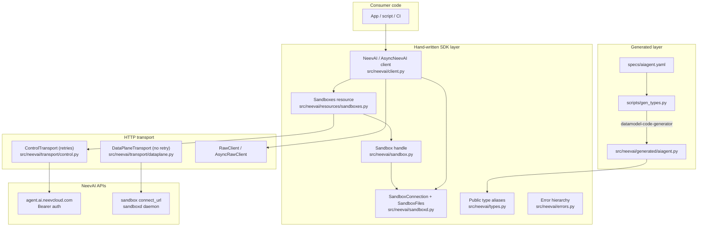

# NeevAI SDK — Architecture Summary

`neevai` is a Python client for the NeevAI platform. It ships one
control-plane resource (`sandboxes`) backed by a hybrid
**OpenAPI-generated types + hand-written wrappers** model, plus a
**data-plane client** (`sandboxd`) for file and exec operations on running
sandboxes.

---

## High-level architecture



---

## Repository layout

```
neev-sdk-python/
+-- specs/                    # Vendored OpenAPI (source of truth for control-plane types)
|   +-- aiagent.yaml
+-- scripts/
|   +-- gen_types.py          # datamodel-code-generator runner
+-- src/neevai/
|   +-- generated/            # AUTO-GENERATED types (never hand-edit)
|   |   +-- aiagent.py
|   +-- resources/            # Hand-written API resource classes
|   |   +-- sandboxes.py
|   +-- transport/            # HTTP transport + retry
|   |   +-- control.py
|   |   +-- dataplane.py
|   |   +-- retry.py
|   +-- client.py             # NeevAI / AsyncNeevAI root client
|   +-- sandbox.py            # Sandbox handle (lifecycle + files/exec ergonomics)
|   +-- sandboxd.py           # Data-plane: SandboxConnection, SandboxFiles, exec
|   +-- types.py              # Public type aliases
|   +-- errors.py
|   +-- __init__.py           # Package exports
+-- tests/                    # pytest, mock transport
+-- examples/
```

## Key design principles

1. **Spec first (control plane)** — update `specs/aiagent.yaml`, then run
   `python scripts/gen_types.py`, then write wrappers.
2. **Thin generated layer** — types only; all UX lives in `resources/`,
   handles, and `sandboxd.py`.
3. **Shared transport pattern** — retrying `ControlTransport` for control
   plane, non-retrying `DataPlaneTransport` for the data plane.
4. **Handles over raw IDs** — lifecycle returns `Sandbox` objects so callers
   can chain `create -> wait_until_ready -> files.write -> exec -> delete`.
5. **Scope model** — `org_id`/`project_id` on client or per-call.
6. **No retries on sandboxd** — exec and writes are not idempotent.
7. **CI enforcement** — generated types must match spec
   (`git diff --exit-code src/neevai/generated`).
