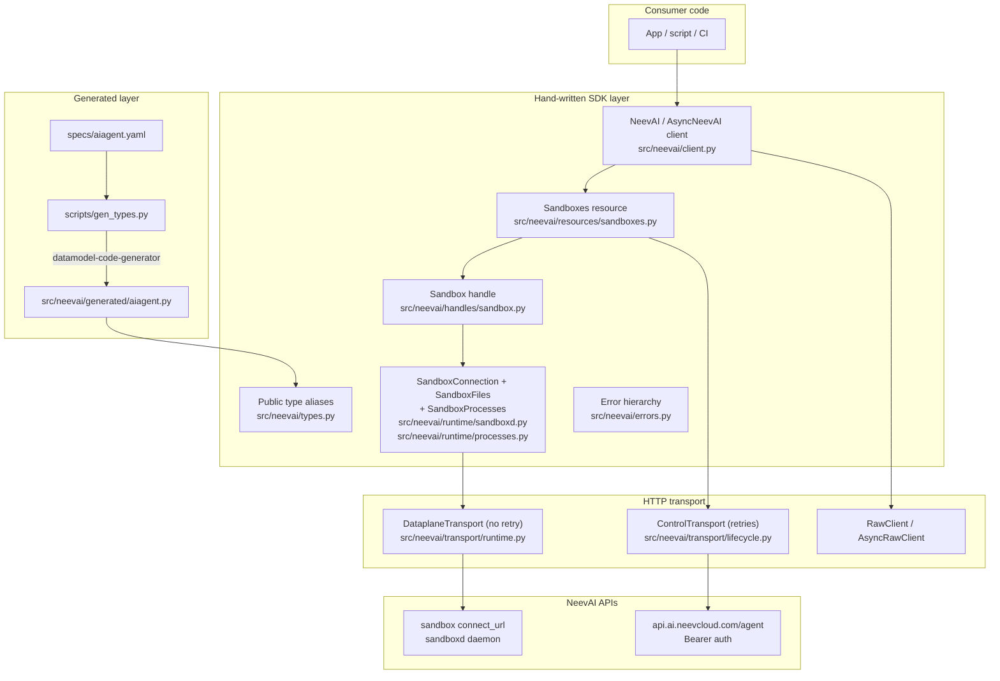
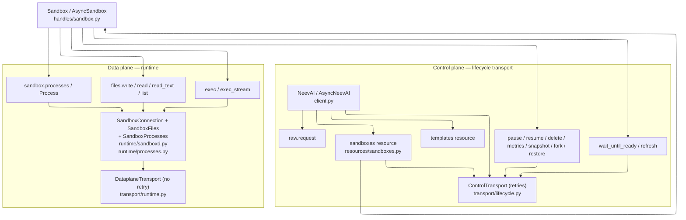

# NeevAI SDK — Architecture

`neevai` is a Python client for the NeevAI platform. The **control plane**
covers sandboxes and templates (lifecycle, metrics, snapshots). The **data plane**
covers exec, files, and supervised processes on the running sandbox daemon
(`sandboxd`).

This document maps the **canonical cross-language SDK layout** to the Python
implementation. See [CONTRIBUTING.md](../.github/CONTRIBUTING.md) for the slot-based
checklist when adding new resources.

---

## Surface-agnostic template

Per-language module layout (mapped from the Python SDK, surface-agnostic):

```
neev-sdk-<lang>/
├── <root client>      # sync + async root clients  (NeevAI / AsyncNeevAI ⇢ neevsdk.New / async equiv)
├── resources/         # hand-written control-plane resource classes (e.g. sandboxes)
├── <handle>           # resource handle objects — "handles over raw IDs"
├── <runtime>          # data-plane client (sandboxd): connection + files + exec
├── transport/
│   ├── lifecycle      #   control-plane transport — WITH retries
│   ├── runtime        #   data-plane transport — NO retries (non-idempotent)
│   └── retry          #   backoff/jitter policy
├── generated/         # AUTO-GENERATED types from monorepo public-specs/ (never hand-edit; no vendored specs/ dir)
├── types              # public type aliases / re-exports (Scope, …)
├── errors             # typed error hierarchy
├── tests/  examples/
```

---

## Python mapping

| Canonical slot | Responsibility | Python path | Key types |
|---|---|---|---|
| `<root client>` | Sync + async entry | `src/neevai/client.py` | `NeevAI`, `AsyncNeevAI` |
| `resources/` | Control-plane resource classes | `src/neevai/resources/sandboxes.py`, `resources/templates.py` | `Sandboxes`, `AsyncSandboxes`, `Templates`, `AsyncTemplates` |
| `<handle>` | Resource handle objects | `src/neevai/handles/sandbox.py` | `Sandbox`, `AsyncSandbox` |
| `<runtime>` | Data-plane connection + files + exec + processes | `src/neevai/runtime/sandboxd.py`, `runtime/processes.py`, `runtime/_stream.py` | `SandboxConnection`, `SandboxFiles`, `SandboxProcesses`, `Process`, async variants |
| `transport/lifecycle` | Control-plane HTTP **with retries** | `src/neevai/transport/lifecycle.py` | `ControlTransport`, `RawClient` |
| `transport/runtime` | Data-plane HTTP **no retries** | `src/neevai/transport/runtime.py` | `DataplaneTransport` |
| `transport/retry` | Backoff/jitter policy | `src/neevai/transport/retry.py` | retry helpers |
| `generated/` | Auto-generated OpenAPI types | `src/neevai/generated/aiagent.py` | Pydantic `BaseModel` schemas |
| `types` | Public aliases / shared types | `src/neevai/types.py` | `Scope`, `SandboxData`, … |
| `errors` | Typed error hierarchy | `src/neevai/errors.py` | `NeevAIError`, … |
| `tests/` / `examples/` | Tests and usage samples | `tests/`, `examples/` | — |

**Public API stays stable:** consumers use `from neevai import ...` via
`src/neevai/__init__.py`, not deep internal paths.

---

## Layer diagram



---

## Public API surface

The diagram below is the **user-facing call flow** organized along two axes
that mirror the [layer diagram](#layer-diagram):

1. **Conceptual plane** — **control plane** (agent API) vs **data plane**
   (sandbox daemon).
2. **Source modules** — **lifecycle transport** (`transport/lifecycle.py`) vs
   **runtime** (`runtime/sandboxd.py`, `transport/runtime.py`).

The `Sandbox` handle bridges both planes: lifecycle methods stay on the control
plane; exec and file I/O cross into the data plane.



**Control plane (lifecycle transport)** — `NeevAI` / `AsyncNeevAI` expose
resource objects (`sandboxes`, `templates`) and a low-level `raw.request`
escape hatch. Handle lifecycle methods (`wait_until_ready`, `refresh`,
`pause`, `resume`, `delete`, `metrics`, `snapshot`, `fork`, `restore`) also live
here. Snapshot rollback can also provision a new sandbox via `from_snapshot` on
create. All of these calls
route through `ControlTransport` in `transport/lifecycle.py` (retries enabled)
to the NeevAI agent API.

**Sandbox handle** — `Sandboxes.create`, `get`, and `list` return a `Sandbox`
(or async variant) rather than a bare ID. The handle is the pivot between
planes: lifecycle methods delegate to the control plane; `exec`, `exec_stream`,
`files.*`, and `processes.*` delegate to the data plane.

**Data plane (runtime)** — Once a sandbox is ready, `exec`, `exec_stream`,
`files.*`, and `processes.*` are served by `SandboxConnection` /
`SandboxFiles` / `SandboxProcesses` in `runtime/sandboxd.py` and
`runtime/processes.py`, which use `DataplaneTransport` in `transport/runtime.py`
(no retries) against the sandbox daemon.

For method signatures, parameters, and return types, see the
[API Reference](./api-reference.md).

---

## Repository layout

```
neev-sdk-python/
+-- specs/                    # Vendored OpenAPI (interim; see Known deviations)
|   +-- aiagent.yaml
+-- scripts/
|   +-- gen_types.py          # datamodel-code-generator runner
+-- src/neevai/
|   +-- generated/            # AUTO-GENERATED types (never hand-edit)
|   |   +-- aiagent.py
|   +-- resources/            # Hand-written API resource classes
|   |   +-- sandboxes.py
|   |   +-- templates.py
|   +-- handles/              # Canonical <handle> slot
|   |   +-- sandbox.py
|   +-- runtime/              # Canonical <runtime> slot (data-plane client)
|   |   +-- sandboxd.py
|   |   +-- processes.py
|   |   +-- _stream.py
|   |   +-- schemas.py
|   +-- transport/            # HTTP transport + retry
|   |   +-- lifecycle.py
|   |   +-- runtime.py
|   |   +-- retry.py
|   +-- client.py             # NeevAI / AsyncNeevAI root client
|   +-- types.py              # Public type aliases
|   +-- errors.py
|   +-- _parse.py             # Internal response coercion helpers
|   +-- __init__.py           # Package exports
+-- tests/                    # pytest, mock transport
+-- examples/
```

---

## Sync/async convention

Python pairs sync and async variants in the **same module** rather than
splitting into separate `sync/` and `async/` trees:

| Module | Sync | Async |
|---|---|---|
| `client.py` | `NeevAI` | `AsyncNeevAI` |
| `resources/sandboxes.py` | `Sandboxes` | `AsyncSandboxes` |
| `handles/sandbox.py` | `Sandbox` | `AsyncSandbox` |
| `runtime/sandboxd.py` | `SandboxConnection`, `SandboxFiles` | `AsyncSandboxConnection`, `AsyncSandboxFiles` |
| `runtime/processes.py` | `SandboxProcesses`, `Process` | `AsyncSandboxProcesses`, `AsyncProcess` |
| `transport/lifecycle.py` | `ControlTransport`, `RawClient` | `AsyncControlTransport`, `AsyncRawClient` |
| `transport/runtime.py` | `DataplaneTransport` | `AsyncDataplaneTransport` |

This is a Python idiom; other language SDKs may use separate trees.

---

## Key design principles

1. **Spec first (control plane)** — update `specs/aiagent.yaml`, then run
   `python scripts/gen_types.py`, then write wrappers.
2. **Thin generated layer** — types only; all UX lives in `resources/`,
   handles, and `runtime/`.
3. **Shared transport pattern** — retrying `ControlTransport` for control
   plane, non-retrying `DataplaneTransport` for the data plane.
4. **Handles over raw IDs** — lifecycle returns `Sandbox` objects so callers
   can chain `create -> wait_until_ready -> files.write -> exec -> delete`.
5. **Scope model** — `org_id`/`project_id` on client or per-call.
6. **No retries on sandboxd** — exec, file writes, and process control are not
   idempotent.
7. **CI enforcement** — generated types must match spec
   (`git diff --exit-code src/neevai/generated`); Pyright and mypy run in CI.
8. **Runtime validation** — control-plane responses are coerced through Pydantic
   models in `resources/` via `neevai._parse`; transport returns untyped JSON.
9. **PEP 561** — `src/neevai/py.typed` marks the package as typed for consumers.

---

## Known deviations

| Deviation | Interim state | Target |
|---|---|---|
| Vendored `specs/` | OpenAPI specs live in-repo under `specs/` | Monorepo `public-specs/` fetched in CI |
| `scripts/gen_types.py` | Python-specific codegen tooling | Not in canonical tree; stays language-specific |
| Flat `.py` modules | `client.py`, `types.py`, `errors.py` are single files | Canonical template shows directory slots; Python uses flat modules where appropriate |

`scripts/gen_types.py` accepts `NEEV_PUBLIC_SPECS` to override the local
`specs/` directory for monorepo development. See
[development.md](./development.md) for details.
