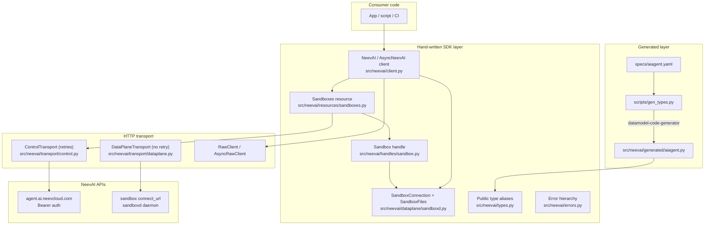

# NeevAI SDK — Architecture

`neevai` is a Python client for the NeevAI platform. It ships one
control-plane resource (`sandboxes`) backed by a hybrid
**OpenAPI-generated types + hand-written wrappers** model, plus a
**data-plane client** (`sandboxd`) for file and exec operations on running
sandboxes.

This document maps the **canonical cross-language SDK layout** to the Python
implementation. See [CONTRIBUTING.md](../CONTRIBUTING.md) for the slot-based
checklist when adding new resources.

---

## Surface-agnostic template

Per-language module layout (mapped from the Python SDK, surface-agnostic):

```
neev-sdk-<lang>/
├── <root client>      # sync + async root clients  (NeevAI / AsyncNeevAI ⇢ neevsdk.New / async equiv)
├── resources/         # hand-written control-plane resource classes (e.g. sandboxes)
├── <handle>           # resource handle objects — "handles over raw IDs"
├── <dataplane>        # data-plane client (sandboxd): connection + files + exec
├── transport/
│   ├── control        #   control-plane transport — WITH retries
│   ├── dataplane      #   data-plane transport — NO retries (non-idempotent)
│   └── retry          #   backoff/jitter policy
├── generated/         # AUTO-GENERATED types from monorepo public-specs/ (never hand-edit; no vendored specs/ dir)
├── types              # public type aliases / re-exports (Scope, …)
├── errors             # typed error hierarchy
├── tests/  examples/
```

---

## Python mapping

| Canonical slot | Responsibility | Python path | Key types |
|---|---|---|---|
| `<root client>` | Sync + async entry | `src/neevai/client.py` | `NeevAI`, `AsyncNeevAI` |
| `resources/` | Control-plane resource classes | `src/neevai/resources/sandboxes.py` | `Sandboxes`, `AsyncSandboxes` |
| `<handle>` | Resource handle objects | `src/neevai/handles/sandbox.py` | `Sandbox`, `AsyncSandbox` |
| `<dataplane>` | Data-plane connection + files + exec | `src/neevai/dataplane/sandboxd.py` | `SandboxConnection`, `SandboxFiles`, async variants |
| `transport/control` | Control-plane HTTP **with retries** | `src/neevai/transport/control.py` | `ControlTransport`, `RawClient` |
| `transport/dataplane` | Data-plane HTTP **no retries** | `src/neevai/transport/dataplane.py` | `DataplaneTransport` |
| `transport/retry` | Backoff/jitter policy | `src/neevai/transport/retry.py` | retry helpers |
| `generated/` | Auto-generated OpenAPI types | `src/neevai/generated/aiagent.py` | `TypedDict` schemas |
| `types` | Public aliases / shared types | `src/neevai/types.py` | `Scope`, `SandboxData`, … |
| `errors` | Typed error hierarchy | `src/neevai/errors.py` | `NeevAIError`, … |
| `tests/` / `examples/` | Tests and usage samples | `tests/`, `examples/` | — |

**Public API stays stable:** consumers use `from neevai import ...` via
`src/neevai/__init__.py`, not deep internal paths.

---

## Layer diagram



---

## Repository layout

```
neev-sdk-python/
+-- specs/                    # Vendored OpenAPI (interim; see Known deviations)
|   +-- aiagent.yaml
+-- scripts/
|   +-- gen_types.py          # datamodel-code-generator runner
+-- src/neevai/
|   +-- generated/            # AUTO-GENERATED types (never hand-edit)
|   |   +-- aiagent.py
|   +-- resources/            # Hand-written API resource classes
|   |   +-- sandboxes.py
|   +-- handles/              # Canonical <handle> slot
|   |   +-- sandbox.py
|   +-- dataplane/            # Canonical <dataplane> slot
|   |   +-- sandboxd.py
|   +-- transport/            # HTTP transport + retry
|   |   +-- control.py
|   |   +-- dataplane.py
|   |   +-- retry.py
|   +-- client.py             # NeevAI / AsyncNeevAI root client
|   +-- types.py              # Public type aliases
|   +-- errors.py
|   +-- __init__.py           # Package exports
+-- tests/                    # pytest, mock transport
+-- examples/
```

---

## Sync/async convention

Python pairs sync and async variants in the **same module** rather than
splitting into separate `sync/` and `async/` trees:

| Module | Sync | Async |
|---|---|---|
| `client.py` | `NeevAI` | `AsyncNeevAI` |
| `resources/sandboxes.py` | `Sandboxes` | `AsyncSandboxes` |
| `handles/sandbox.py` | `Sandbox` | `AsyncSandbox` |
| `dataplane/sandboxd.py` | `SandboxConnection`, `SandboxFiles` | `AsyncSandboxConnection`, `AsyncSandboxFiles` |
| `transport/control.py` | `ControlTransport`, `RawClient` | `AsyncControlTransport`, `AsyncRawClient` |
| `transport/dataplane.py` | `DataplaneTransport` | `AsyncDataplaneTransport` |

This is a Python idiom; other language SDKs may use separate trees.

---

## Key design principles

1. **Spec first (control plane)** — update `specs/aiagent.yaml`, then run
   `python scripts/gen_types.py`, then write wrappers.
2. **Thin generated layer** — types only; all UX lives in `resources/`,
   handles, and `dataplane/`.
3. **Shared transport pattern** — retrying `ControlTransport` for control
   plane, non-retrying `DataPlaneTransport` for the data plane.
4. **Handles over raw IDs** — lifecycle returns `Sandbox` objects so callers
   can chain `create -> wait_until_ready -> files.write -> exec -> delete`.
5. **Scope model** — `org_id`/`project_id` on client or per-call.
6. **No retries on sandboxd** — exec and writes are not idempotent.
7. **CI enforcement** — generated types must match spec
   (`git diff --exit-code src/neevai/generated`).

---

## Known deviations

| Deviation | Interim state | Target |
|---|---|---|
| Vendored `specs/` | OpenAPI specs live in-repo under `specs/` | Monorepo `public-specs/` fetched in CI |
| `scripts/gen_types.py` | Python-specific codegen tooling | Not in canonical tree; stays language-specific |
| Flat `.py` modules | `client.py`, `types.py`, `errors.py` are single files | Canonical template shows directory slots; Python uses flat modules where appropriate |

`scripts/gen_types.py` accepts `NEEV_PUBLIC_SPECS` to override the local
`specs/` directory for monorepo development. See
[development.md](./development.md) for details.
